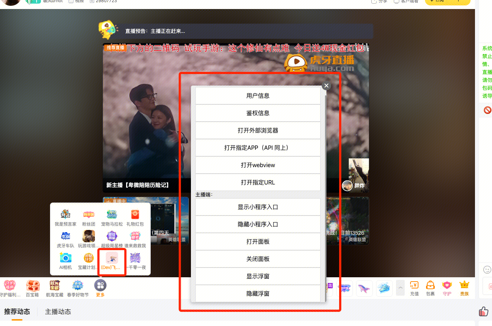
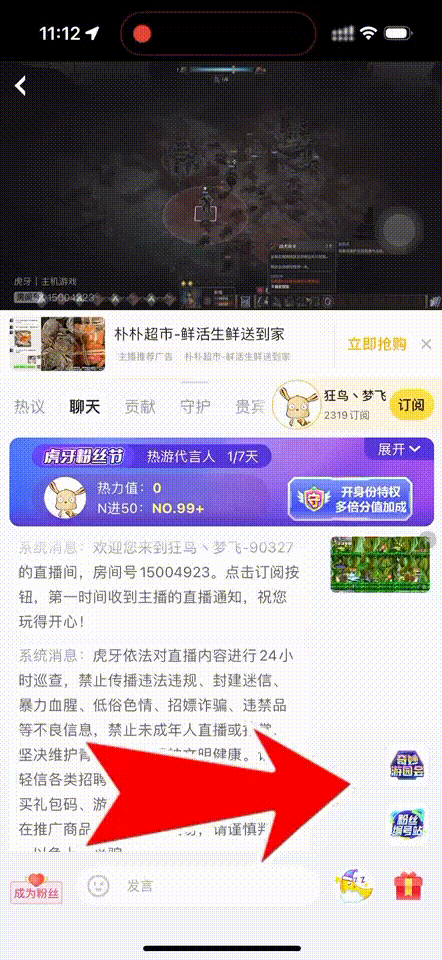
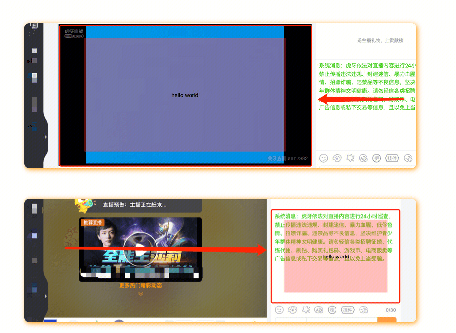
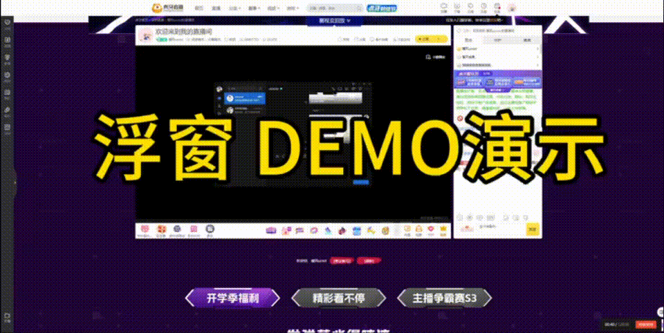

# huya-miniapp

虎牙小程序开发Demo。

## 基础资源

- [SDK开发文档](https://dev.huya.com/docs/miniapp/dev/guide/quick-start/create-miniapp/)

- [UI 组件文档](https://hd.huya.com/web/hy-ui-doc/teach/#?c=Badge)

- [官方 UI 组件示例 demo](https://github.com/huya-ext/hy-ui-demo)

- [开发者中心——管理小程序](https://ext.huya.com/#/)

- [开发环境预览](https://dev.huya.com/docs/miniapp/dev/guide/quick-start/add-to-live-room/)

- [小程序商店](https://appstore.huya.com/#/)

## SDK

### 用户信息

#### 小程序unionId

小程序unionId是用于标注小程序用户（主播/观众）的身份标识。一个开发者下的多个小程序中，同一个用户，可通过unionId来区分用户的唯一性。

#### 名词解析

- unionId：用户唯一标识，小程序所有用户的身份标识统称。

- profileId：主播的唯一标识（unionId），如SDK接口、小程序API出现该字段，代表该标识是当前小程序运行所在直播间的主播。

- userId：观众的唯一标识（unionId），，如SDK接口、小程序API出现该字段，代表该标识是当前使用小程序的观众。

#### 小程序unionId的获取方式

当用户（主播/观众）授权使用小程序后，可通过以下方法获取：

1、调用SDK接口hyExt.vip.getJWT，获取到Token，解密数据中获取profileId和userId。

2、调用SDK接口hyExt.request，发送请求到小程序开发者后台服务器，从header中获取到authorization，解密数据中获取profileId和userId。

#### 解密方式

请参考[统一鉴权说明](https://dev.huya.com/docs/miniapp/dev/open/verify/)。

## 直播事件

| 名称 | API | 可获取的关键信息 |
| --- | --- | ---------------- |
| 弹幕 | 引导当前用户发送弹幕（hyExt.context.leadBarrage） 监听弹幕消息（hyExt.context.onBarrageChange） 取消监听弹幕消息（hyExt.context.offBarrageChange） | 发言人的昵称 弹幕内容 用户unionId |
| 订阅 | 引导当前观众订阅当前主播（hyExt.context.leadSubscribe） 获取当前观众订阅状态（hyExt.context.getSubscribeInfo） 获取当前主播订阅概况（hyExt.context.getSubscriberSummary） 监听当前主播订阅变化消息（hyExt.context.onSubscriberChange） 取消监听当前主播订阅变化消息（hyExt.context.offSubscriberChange） | 用户昵称 |
| 分享直播间 | 监听分享直播间事件（hyExt.context.onShareLiveNotice） 取消监听分享直播间事件（hyExt.context.offShareLiveNotice） | 直播间跳转链接 分享内容 房间Id 主播unionId 分享人的unionId |
| 礼物 | 引导当前观众送礼（hyExt.context.leadGift） 监听当前直播间礼物变化消息（hyExt.context.onGiftChange） 取消监听当前直播间礼物变化消息（hyExt.context.offGiftChange） 获取当前直播间礼物配置（hyExt.context.getGiftConf） 当前观众送礼（hyExt.context.sendGift） | 礼物发送人信息 礼物数量 礼物价格 |
| 守护 | 监听开通守护（hyExt.context.onOpenGuardianNotice） 关闭监听开通守护（hyExt.context.offOpenGuardianNotice） | 开通或者续费天数 用户unionId 守护类型, 0-初爱守护, 2-超级守护, 3-至尊守护 |
| 贵族 | 监听开通贵族（hyExt.context.onOpenNobleNotice） 关闭监听开通贵族（hyExt.context.offOpenNobleNotice） | 开通月数 贵族名 用户unionId |

## 场景结合示例
一个结合直播事件监听开发的场景示例：

**本文件视频在：[scene_demonstration](./assets/videos/scene_demonstration.mov)**

## 小程序类型

### 面板

在PC 端和 APP 端均是一个弹窗

**本文件视频在：[example_panel](./assets/videos/example_panel.mov)**

### 浮窗

普通开发者没有权限，需要申请进阶及以上权限，浮窗可以设置大小、位置，可以显示在视频区域也可以显示在聊天区域。

**本文件视频在：[example_floating](./assets/videos/example_floating.mov)**

### 小程序控制直播图层

文档：https://dev.huya.com/docs/miniapp/dev/scenario/exe-new/

使用：普通开发者不可使用，需要向虎牙申请权限

**本文件视频在：[exe_demo](./assets/videos/exe_demo.mov)**

## UI组件

虎牙有一套开发好的 UI 组件库，但内容较少——UI 组件文档，虎牙小程序时以 react-native 为基础开发的，因此，react-native 的组件也能直接引入，但可能会出一些未知的问题：

- className 失效；

- 没有 style 属性；

## QA
Q: 出现相关 className 的TS语法错误怎么办？
A: 打开vscode控制台，输入`restart ts server`, 重启本地ts服务就行。

## 出现的问题
- 弹窗如 modal、bottomModal 不能和 Form 一起用，会导致即使 modal 已经关闭，半透明遮罩还在的情况.